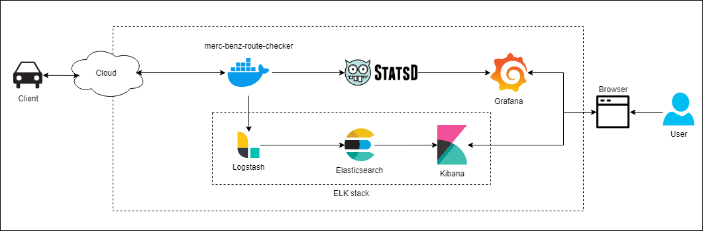

# merc-benz-route-checker

## Intro

The application is to identify the minimum number of stations required to stop for recharging your car when travelling from a source to a destination.

## Tech stack

* Language: golang
* [Gin](https://github.com/gin-gonic/gin) for Http web framework
* [Zap logger](https://github.com/uber-go/zap) for logging
* [Lubmerjack](https://github.com/natefinch/lumberjack) for log writing and rotation
* Docker containerization
* ELK stack for log analysis
* Graphite, Statsd and Grafana for metric collection and visualization

## Architecture

The below is the architecture diagram

## Log analysis and Instrumentation

* By using ELK stack, the microservice can push logs into logstash in the port `8089` which can be visualized in kibana.
* By using statsd, the microservice pushes metrics into graphite in the port `8125`. These can be visualized in grafana.
    * The dashboard config for the microservice can be found in [graphite-dashboard.json](./graphite-dashboard.json)
* This repo doesn't include setup for ELK stack, Graphite, Statsd or Grafana. The microservice is coded in a way that it will push logs and metrics if the URL is configured.

## Running the app using docker

### Run from docker hub

Use the below command to run the docker container from docker hub

#### Without log analysis and metrics instrumentation

Use the below command to build the docker image from dockerhub.

`sudo docker run --name=merc-benz-route-checker --network="host" -p 8080:8080 sdjthedeveloper/merc-benz-route-checker:prod`

This image is prebuilt without logstash or statsd configured. To test the API, use the postman collection in [merc-benz-route-checker.postman_collection.json](./postman-collection/merc-benz-route-checker.postman_collection.json)

#### With log analysis and metrics instrumentation

To run the image with ELK stack and instrumentation, the required services should be running. I have created a separate repo [techgig-interview-mbenz-containerized](https://github.com/SDJLee/techgig-interview-mbenz-containerized) that has a `docker-compose.yml` to bring up the microservice along with other services.

### Run in local by building a docker image

Use the below command to build the docker using [Dockerfile](./Dockerfile).

#### Without log analysis and metrics instrumentation

`docker build . -t merc-benz-route-checker --build-arg MODE=prod`

#### With log analysis and metrics instrumentation

Assuming statsd and logstash are running in `<docker_ip>:8125` and `<docker_ip>:8089` respectively, run the below build command.

`docker build . -t merc-benz-route-checker --build-arg MODE=prod --build-arg SHIPLOGS=true --build-arg GRAPHITE_URL=<docker_ip>:8125 --build-arg LOGSTASH_URL=<docker_ip>:8089`

##### Flags

* MODE
    * Says whether the build is development or production.
    * Values are `prod` or `dev`.
    * If left empty, default build mode is `dev`.
* SHIPLOGS
    * Set `true` if the logs should be shipped into logstash.
    * By default, it is `false`.
    * When set `true`, make sure logstash service is up and accessible by the microservice.
* GRAPHITE_URL
    * URL for statsd
* LOGSTASH_URL
    * URL for logstash

#### Running the container

Use the below command to run the docker image that was built with any of the previous command.

`docker run -p 8080:8080 --name merc-benz-route-checker <image id>`

Once the docker container is up, the APIs can be accessed under the host address [http://localhost:8080](http://localhost:8080)

## Working Prototype

The microservice has been deployed in AWS along with ELK stack, Graphite, Statsd and Grafana. These services are available in below URLs. The URLs to access the services will be attached in the PPT submitted along with the interview.

### To the interviewer
If the working prototype is not accessible, mail me at [mail.soundar.rajan@gmail.com](mail.soundar.rajan@gmail.com). I might have shut the services down for cost concerns.

## APIs

### Local build

For a local build, the below are the APIs available. The same can be found under the postman collection [merc-benz-route-checker.postman_collection.json](./postman-collection/merc-benz-route-checker.postman_collection.json)

* [http://localhost:8080/api/health](http://localhost:8080/api/health) - health check API
* [http://localhost:8080/api/v1/compute-route](http://localhost:8080/api/v1/compute-route) - API to compute route with minimum number of stops

### Working prototype

To test the working prototype, use the postman collection [merc-benz-route-checker.postman_collection.json](./postman-collection/merc-benz-route-checker.postman_collection.json). Try out the APIs by updating the API URL with the one provided in the PPT.

### Using postman variable to toggle URL

* Import the postman collection
* Right-click the collection -> Edit
* Go to `Variables` tab
* Toggle the `url` variable between the IP address provided in PPT and `localhost` to switch between the test environment.

### Screenshots

The below are few screenshots of few test cases.

#### Testcase 1

The car can reach destination by reaching two stations S1 and S2.

#### Testcase 2

The car has enough fuel and doesn't require charging.

#### Testcase 3

The car cannot reach the destination even by visiting stations.

#### Testcase 4

A negative test case where the destination is invalid.

#### Testcase 5

A negative test case where the VIN is invalid.

### Logging

The below is a screenshot of Kibana dashboard

### Instrumentation

#### Grafana screenshots for the requests

##### API Response time

API response time shows the time taken for the `/api/v1/compute-route` to compute and respond.

#### Request stats

This panel shows the count of,
* Cars that successfully reached destination visiting stations
* Cars that couldn't reach stations even after charging
* Cars that doesn't require charging and has sufficient charge to reach destination
* Invalid requests due to invalid VIN, source name or destination name.

#### External API response time

This panel shows the time taken for the microservice to retrieve data from other microservices

#### Unique user count

This panel displays the number of unique users (VIN) that uses the microservice.

#### Algorithm computation time

This panel displays the time taken by the algorithm to compute stations list. It is measured in milliseconds. This panel displays 0 when the computation takes less than milliseconds. This depends on the machine the container is hosted in.

## About the logic to find the minimum number of charging station

The algorithm uses greedy approach with priority queue. With the greedy approach, we charge the car only at stations that can provide maximum number of charges when compared to all other stations at that state. Below is the logical explanation of the method.
1. We find out the maximum distance the car can travel with available charge.
2. If the destination can be reached with available charge, we return an empty slice. It means that there is no need for the car to stop for recharging since the available charge is sufficient.
3. If the destination cannot be reached with available charge, the logic simulates the car to travel to maximum distance possible noting down the stations along the route in priority queue.
4. The priority queue will be in descending order respect to the charge available in station. For example, if the station and charge pair are S1:10, S2:20, S3:30, then the priority queue will return in the order S3:30, S2:20, S1:10. We always pick the next station that provides maximum charge.
5. If the charge in a station is not sufficient, we pick the next station from the priority queue. This is done till either the queue is empty or the charge becomes sufficient.
6. The station names where the car recharges are added to the returning slice.

The time complexity of this logic is O(nlog(n)). We iterate n times and greedily check if recharge is required.

The space complexity of this logic is O(n)

## Addition of .env files

The `app-dev.env` and `app-prod.env` files haven't been ignored in git for reference.
